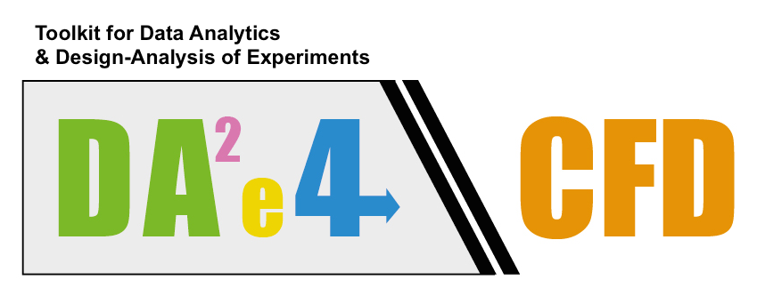

<!--# DAE4CFD-->

###What you will find here:

* In the directory **sample_datasets** you will find a few datasets ready to use:

	* **working/set1/**: data obtained from a CFD optimization study of a daggerboard.
	* **working/set2/**: famous Iris flower data set.
	* **working/set3/**: data obtained from a multidimensional CFD study of different NACA airfoils.
	* **working/set4/**: data obtained from a multiobjective optimization study of a cone.  Minimize lateral and bottom surface subject to a volume constraint.

&nbsp;
&nbsp;

* In the directory **scatterplot** you will find the script for interactive scatter plot.  To install it, copy the whole directory and put it wherever you want.  In order to use it you need to be conneted to internet.
* To use the scatterplot script go to the directory **scatterplot/html** and open the file scatterplot.html:
	* Choose the type of separator. Comma for csv files and tab for tables separated with spaces (tsv files).  In the sample datasets, files with the .csv extension are comma separated and files with the extension .txt and tab separated.
	* Press browse to look for the file.  For the moment the file must be in your computer.  
	* Select the variables you want to plot and press plot.  
	* You can also select the dimension of the canvas. Set the desired dimensions in the boxes chart width and chart height.
	*  When your plot is showing, select a region in the main chart to compute the basic statistics of that set, you will see the general statistics in your right. You can redimension and traslate the selection area.
	*  If you mouse over a point you will see to your left the information related to that point.  
	*  In the bottom of the main chart you have the navigator, use it to zoom in/out and translate the selection area.
	*  The remove selected option is working.  To remove points (outliers), click on the points in the main chart and then press remove selected.  To replot the original data press plot.
	*  The export selected option is working but it is not enable in this preview.
	*  This script should run in any device (PC, smartphone, tablet). 
	*  If you use this script and you break it, please let us know (joel.guerrero@unige.it).
	*  Also, if you have suggestions, do not hesitate in contacting us.
	